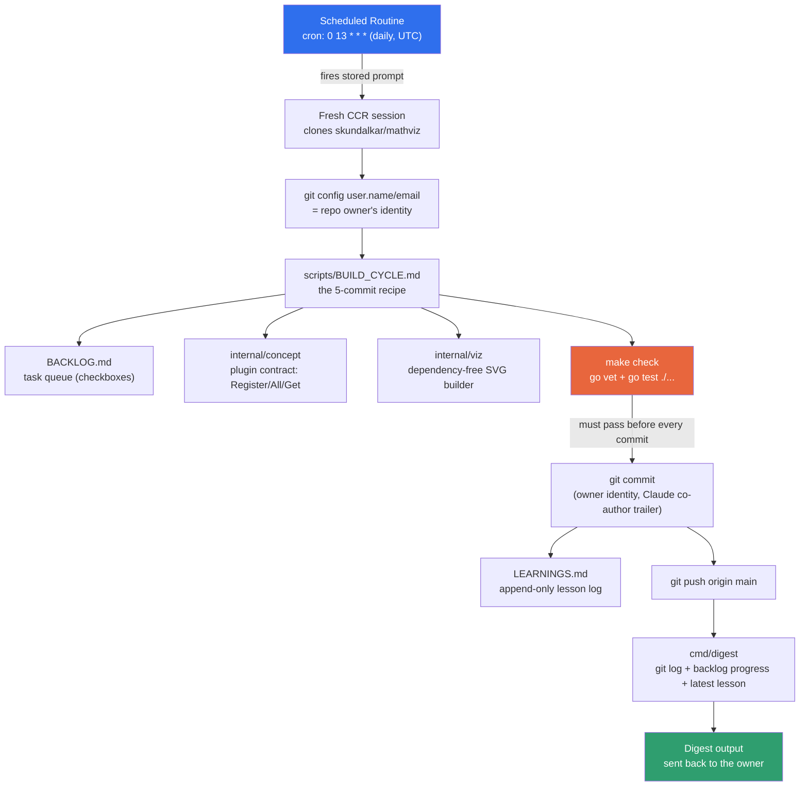

# Automation — how the daily build loop actually works

This file exists because the repo owner asked, in a live session on
2026-08-08: *"what all was required on your part as an agent — did you just
create one large prompt encapsulated around a cron job, or was there more
coding involved?"* The answer below is preserved close to verbatim from that
conversation, plus two diagrams added afterward at the owner's request. If
the automation changes, update this file in the same commit.

---

## The verbatim answer

> Concretely, here's what's actually running under the hood — pulled from
> the live trigger config to answer precisely rather than guess:
>
> **The scheduling layer (genuinely is "just a cron job + a prompt")**
> ```
> name: MathViz daily build (3 concepts)
> cron: 0 13 * * *          (daily, 13:00 UTC)
> mode: fresh session per fire, in a dedicated environment
> repo attached: skundalkar/mathviz
> tools allowed: Bash, Read, Write, Edit, Glob, Grep
> model: claude-sonnet-5
> ```
> Every morning it spins up a brand-new session, clones the repo fresh, and
> sends it one stored prompt (git identity setup → read
> `scripts/BUILD_CYCLE.md` → build 3 backlog items → push → run digest).
> That part really is as simple as it sounds: a scheduled trigger firing a
> static instruction block.
>
> **What makes that prompt actually *work*, though, isn't the prompt — it's
> scaffolding that had to be engineered into the repo beforehand:**
>
> - **`internal/concept`** — a small Go interface (`Concept{ID, Title,
>   Blurb, Params, Render}` + a global `Register`/`All`/`Get`) that every
>   concept plugs into. Without this contract, "build a concept" has no
>   defined shape for the loop to follow.
> - **`internal/viz`** — a dependency-free SVG builder (axes, paths,
>   shading, ticks) every concept's `render()` calls. This is what lets a
>   text-only agent produce a real interactive picture instead of just
>   prose.
> - **`Makefile` → `make check`** — `go vet` + `go test ./...`, the hard
>   gate the prompt insists must pass before *every single commit*. This is
>   what stops a bad run from ever landing broken code on `main`.
> - **`BACKLOG.md`** — the task queue itself (checkbox list), so "pick the
>   first unchecked item" is a well-defined, deterministic instruction
>   rather than "invent something."
> - **`LEARNINGS.md`** — append-only lesson log, the actual pedagogical
>   output.
> - **`cmd/digest`** — a small Go program that shells out to `git log`,
>   reads `BACKLOG.md`'s checkbox counts, and pulls the newest
>   `LEARNINGS.md` entry into one Markdown report. That's the thing that
>   gets sent back to the owner — it doesn't exist without someone writing
>   it.
> - **`scripts/BUILD_CYCLE.md`** — the detailed 5-commit recipe (scaffold →
>   math → tests → render → docs), versioned *in the repo*, not baked into
>   the trigger — so it can be edited without touching the schedule.
>
> So it's a two-layer system: a thin, genuinely simple cron+prompt layer,
> sitting on top of a real, purpose-built plugin architecture, test gate,
> and reporting tool that took actual software design to get right — that's
> the part that turns "an LLM ran a prompt" into "13 tested, working,
> documented concepts landed on main with nothing broken."
>
> And the same-day conversation this file comes from is a live example of
> the coding side: building bayes-theorem/roc-auc/confusion-matrix was ~15
> commits of real Go — math functions, unit tests asserting known values
> and invariants, SVG render logic, docs — not generated from the daily
> prompt at all, but from the owner and the agent iterating directly. The
> scheduled loop handles the routine, incremental case; anything that needs
> judgment (like a full rewrite pass across 12 concepts' explanations) still
> needs a live back-and-forth like that one.

---

## Architecture — what's wired to what



## Daily flow — the 5-commit cycle, repeated per concept

```mermaid
sequenceDiagram
    participant Loop as Build loop (agent)
    participant Repo as Repo files
    participant Check as make check

    Loop->>Repo: read BACKLOG.md, pick first unchecked item
    Note over Loop,Repo: repeats for up to 3 concepts per run

    Loop->>Repo: scaffold <id>.go + register in internal/concepts/all
    Loop->>Check: run
    Check-->>Loop: pass
    Loop->>Repo: commit 1 — feat: scaffold + register

    Loop->>Repo: add pure math functions (no globals, no rand, no time)
    Loop->>Check: run
    Loop->>Repo: commit 2 — feat: pure math

    Loop->>Repo: add <id>_test.go (known values + invariants + render smoke test)
    Loop->>Check: run
    Loop->>Repo: commit 3 — test: unit tests

    Loop->>Repo: implement render() with viz helpers
    Loop->>Check: run
    Loop->>Repo: commit 4 — feat: interactive SVG render

    Loop->>Repo: prepend LEARNINGS.md entry, tick BACKLOG.md
    Loop->>Check: run
    Loop->>Repo: commit 5 — docs: explain + tick backlog

    Loop->>Repo: git push origin main
    Loop->>Repo: go run ./cmd/digest
    Repo-->>Loop: digest report (commits, progress, today's lesson)
```

---

*This file documents the automation as of 2026-08-08. It is not itself
regenerated by the daily loop — update it by hand (or ask the agent to)
whenever the trigger, `BUILD_CYCLE.md`, or the supporting Go packages change
in a way that would make this out of date.*
